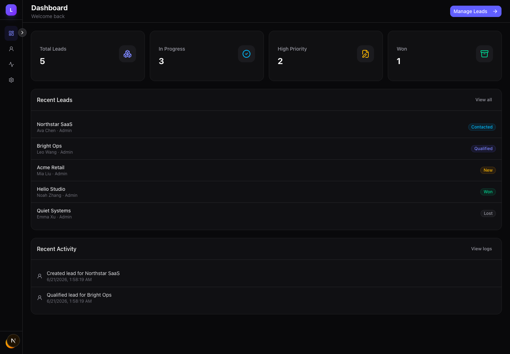
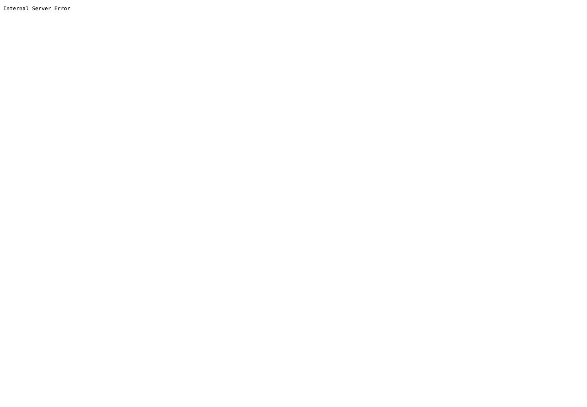

# Lumen Admin

A reusable admin/backoffice template for CRM, operations dashboards, content tools, and internal apps. Built with **Next.js 16**, **React 19**, **TypeScript**, **better-auth**, **Drizzle**, and **SQLite**.



## Screenshots




## Features

- Email/password auth with protected dashboard routes
- Leads module with server-side pagination, search, status filter, priority filter, create, edit, delete
- CSV export using the current list filters
- Audit logs for lead create/update/delete actions
- Dashboard stats, recent leads, and recent activity
- Collapsible sidebar, mobile drawer, sign out, dark/light theme
- CI-ready scripts for lint, typecheck, format check, and build

## Stack

- Next.js App Router / React / TypeScript
- Tailwind CSS / shadcn/ui / Lucide React
- better-auth
- Drizzle ORM / SQLite / better-sqlite3
- Zod
- Bun

## Quick Start

```bash
bun install
cp .env.example .env
bun run db:migrate
bun run db:seed
bun run dev
```

Open `http://localhost:3000`. Register from the login page or use the local demo account:

```text
admin@lumen.app
password123
```

## Scripts

```bash
bun run dev
bun run lint
bun run typecheck
bun run format:check
bun run build
bun run db:migrate
bun run db:seed
```

## Deployment

The repo includes `render.yaml`. Prefer Render, Railway, Fly, or another long-running platform with persistent disk support. The app uses SQLite, so a serverless target without persistent storage is not a good fit for the full authenticated demo.

Render settings:

```text
Build Command: bun install --frozen-lockfile && npm rebuild better-sqlite3 && bun run build
Start Command: bun run deploy:start
DATABASE_URL: /var/data/lumen.db
BETTER_AUTH_SECRET: generated random value
BETTER_AUTH_URL: your real production URL
Disk mount path: /var/data
```

## Resume Summary

```text
Lumen Admin reusable backoffice template
Stack: Next.js, React, TypeScript, Tailwind CSS, shadcn/ui, better-auth, Drizzle, SQLite

- Built a reusable admin template with authentication, protected routes, responsive app shell, theme switching, and sign out.
- Implemented a Leads module with server-side pagination, search, status/priority filters, create/edit/delete, and CSV export.
- Designed SQLite tables with Drizzle for leads and audit logs, using server actions and zod for validation, writes, audit records, and revalidation.
- Added lint, typecheck, format check, and production build scripts so the project can start future CRM, operations, or internal-tool products.
```

## Interview Pitch

```text
Lumen is a reusable admin template I built for CRM, operations dashboards, and internal tools.

It uses Next.js, React, TypeScript, better-auth, Drizzle, and SQLite. The app includes auth, protected routes, lead management, server-side pagination and filtering, CSV export, and audit logs.

The goal is to show practical business frontend delivery: tables, filters, modal forms, status display, validation, responsive admin layout, and the full loop from UI interactions to server-side writes.
```
